<div style="text-align:center"></div>

# Grocery Galleria

---
## Project of CS24

**Team Members**

 - Dilshan Thenuka - [@Dilshan98-code](https://github.com/Dilshan98-code)
 - Sanduni Sandeepa - [@sanduni-sandeepa](https://github.com/sanduni-sandeepa)
 - Wathsala Vishwajith [@wathsala-vishwajith](https://github.com/wathsala-vishwajith)

## Demo
---

### Customer 
<div style="text-align:center"></div>
<div style="text-align:center">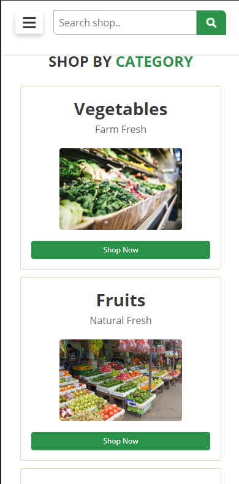</div>
<div style="text-align:center, display:flex, flex-direction:column">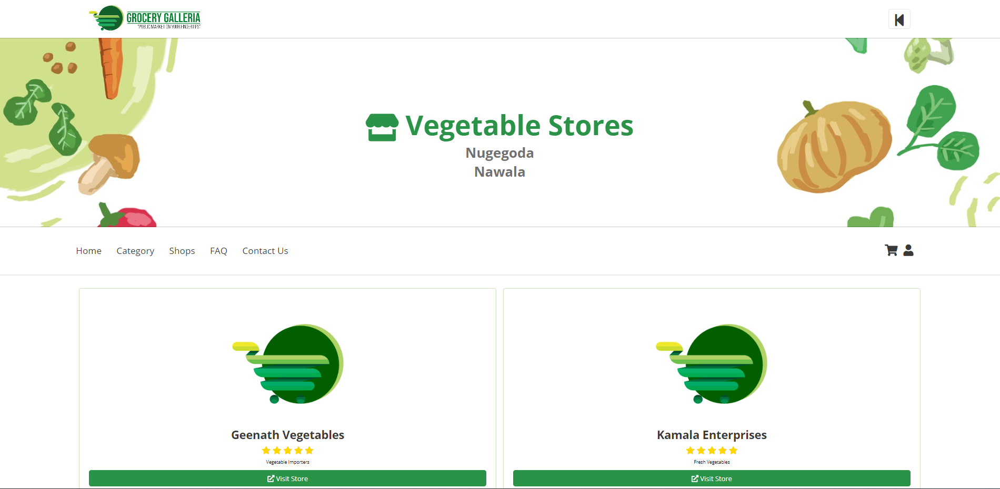</div>
<div style="text-align:center"></div>
<div style="text-align:center">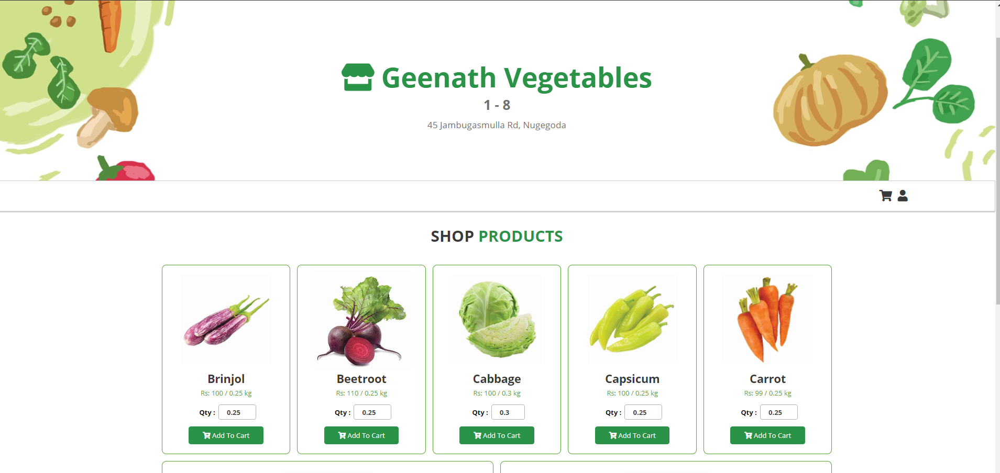</div>
<div style="text-align:center">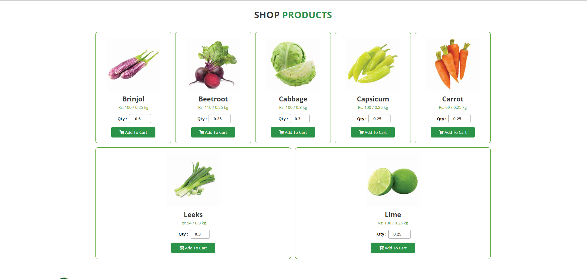</div>
<div style="text-align:center">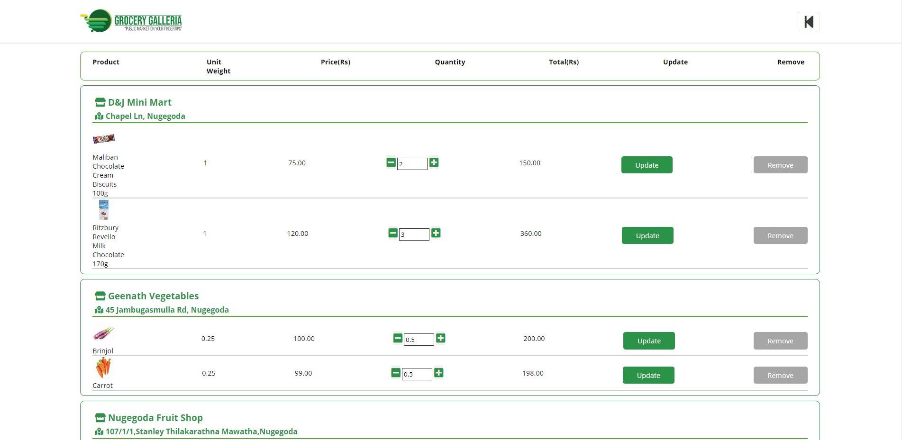</div>
<div style="text-align:center">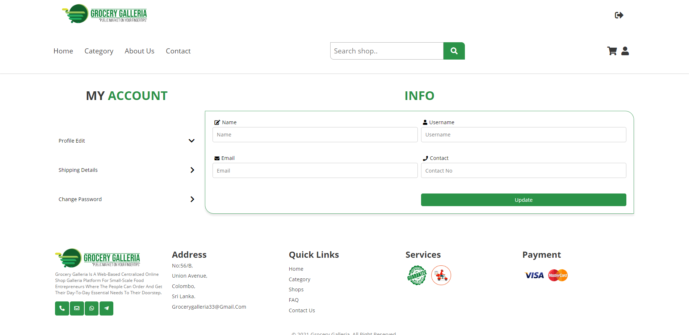</div>
<div style="text-align:center">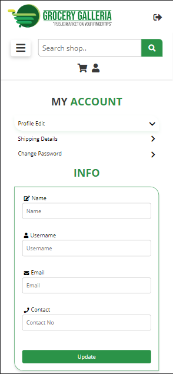</div>

### Shop Dashboard
<div style="text-align:center">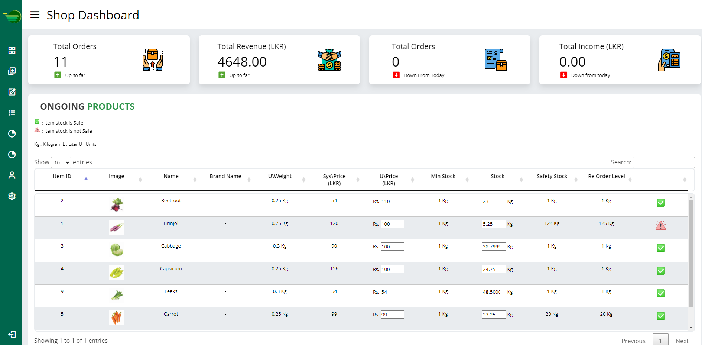</div>
<div style="text-align:center">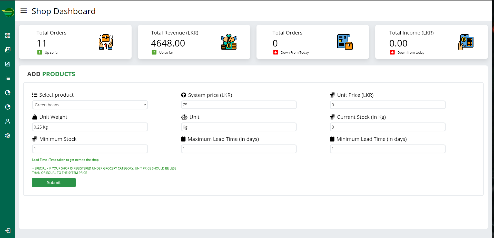</div>

### Staff Dashboard
<div style="text-align:center">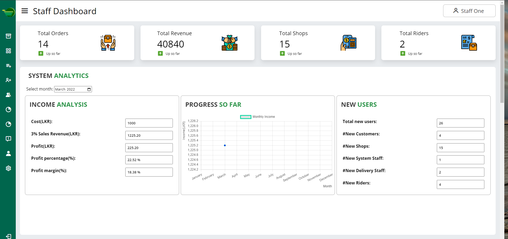</div>

<div style="text-align:center">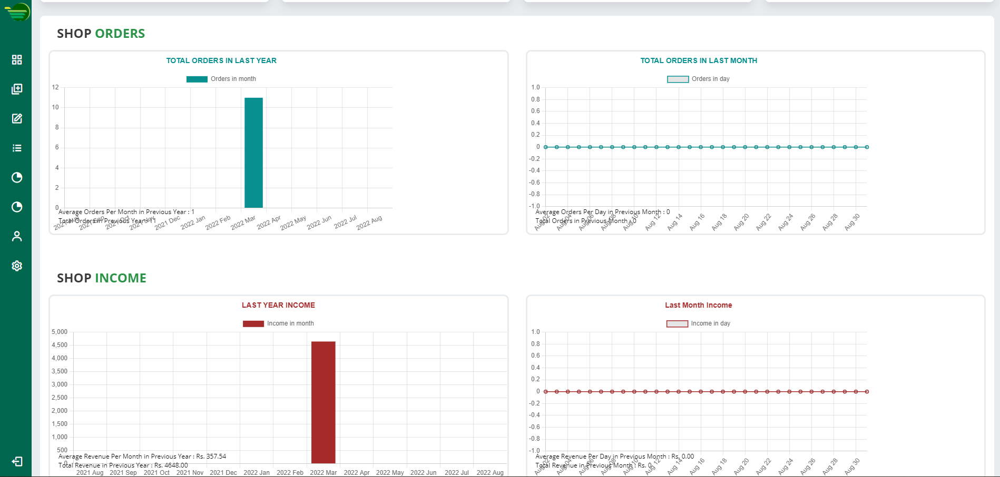</div>

### Delivery Dashboard
<div style="text-align:center">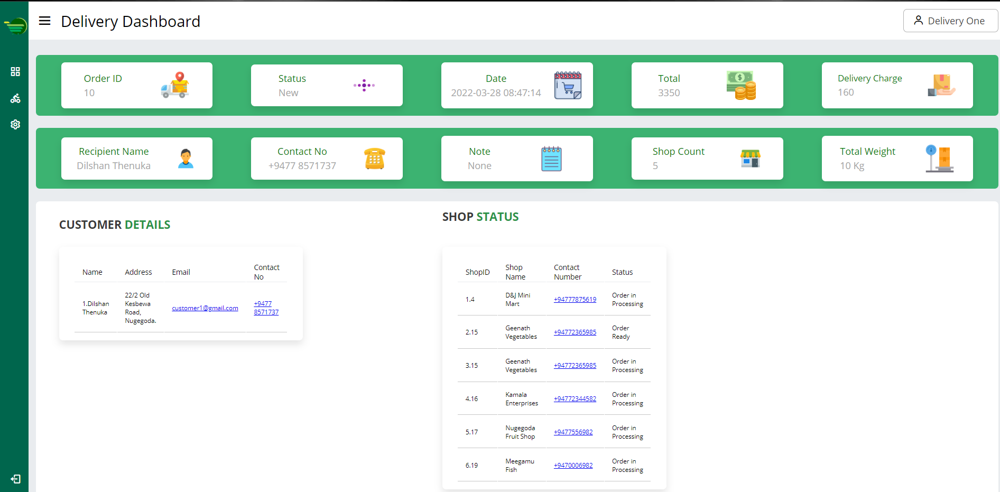</div>
<div style="text-align:center">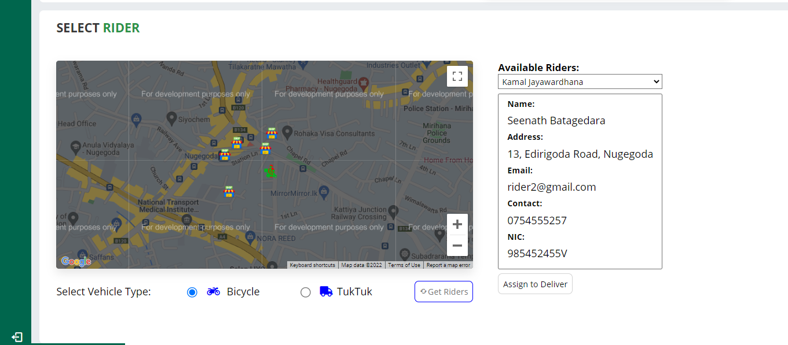</div>

### Delivery Rider Web Application
<div style="text-align:center">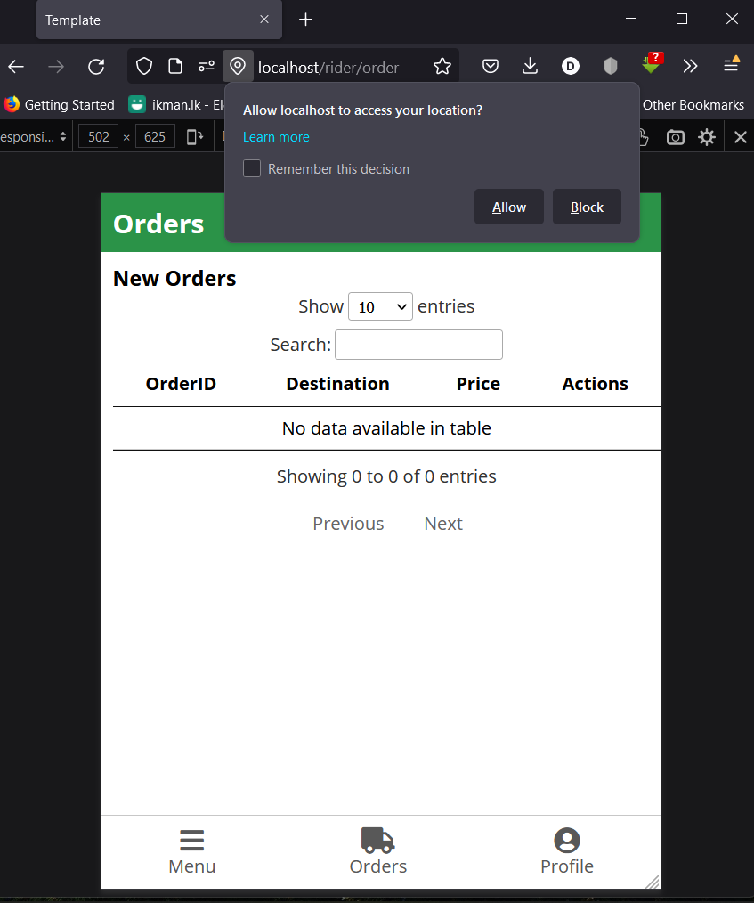</div>


## Instructions 
1. Clone this repository.
2. run `composer install`
3. Populate the .env file referencing the .env.sample
4. Use Stripe CLI to enable forwarding of the payment webhooks
`stripe listen --forward-to localhost/pay`
5. https://stackoverflow.com/questions/869092/how-to-enable-mod-rewrite-for-apache-2-2


---

## Git subtree for the core folder
Use Latest Git.
This project uses subtrees for modularizing the core folder.
Use,
[Stackoverflow Reference](https://stackoverflow.com/questions/36554810/how-to-link-folder-from-a-git-repo-to-another-repo)
[Atlassian Blog](https://blog.developer.atlassian.com/the-power-of-git-subtree/)

clone:

    git subtree add --prefix core https://github.com/Group-24-VDSL/framework-core.git main --squash

pull:

    git subtree pull --prefix core https://github.com/Group-24-VDSL/framework-core.git main --squash

push:

    git subtree push --prefix core https://github.com/Group-24-VDSL/framework-core.git main


Also make sure you change your document root to the, <br>
    DocumentRoot "<XAMMP_HOME>/htdocs/Grocery-Galleria/public"

 ## Folder Structure

```text
├── controllers - 
├── core  
├── models
├── public
│   ├── css
│   │   ├── **/*.css
│   ├── favicon.ico
│   ├── images
│   ├── index.php
│   ├── js
│   └── └── **/*.js
├── runtime
├── views
│   ├── layouts
├── README.md
├── composer.json
└── .gitignore
```


